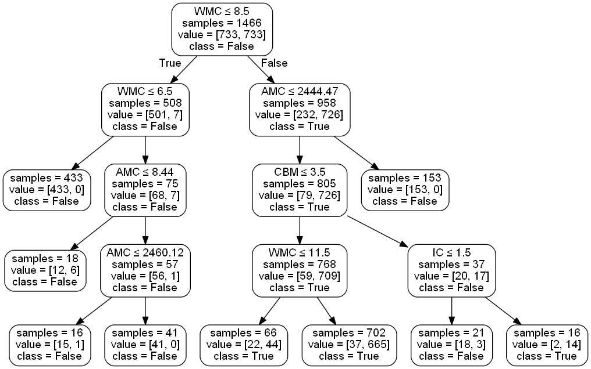

# Project to Anti-bloater Class Restructuring

This is the replication package for the paper: `Anti-bloater class restructuring: an exploratory study`.

## Getting Started

Download the files to your computer and check the prerequisites to reproduce the results.

### Prerequisites

To run you will need the following requirements:

a) R Project 4.0.4 or higher avaliable in: https://www.r-project.org/ Packages:

* Hmisc - Harrell Miscellaneous - https://cran.r-project.org/web/packages/Hmisc/index.html

* dplyr - A Grammar of Data Manipulation - https://cran.r-project.org/web/packages/dplyr/index.html

* data.table - Fast aggregation of large dat - https://cran.r-project.org/web/packages/data.table/index.html

b) Python 3.7.0 or higher avaliable in: https://www.python.org/ Packages:

* pandas - https://pypi.org/project/pandas/

* sklearn - https://scikit-learn.org/stable/install.html 

* pydotplus - https://pypi.org/project/pydotplus/ 

c) Jupyter Project avaliable in: https://jupyter.org/

## Section 4. AN EXPLORATORY TEMPORAL STUDY OF CLASS STRUCTURE

1) Extract the file `MetricsPerClassReleaseOrdered.csv` from file `MetricsPerClassReleaseOrdered.csv.zip`. This file has the metrics for all classes per release ordered by class name and release. We used the tool CKJM extended to collect structural and quality metrics for these classes in all available releases. So, the data on this file is used to select classes that were restructured (next step).

2) Run R Script (`ExtractPositiveClasses.R`) to extract restructured classes from `MetricsPerClassReleaseOrdered.csv`. This script analyzes the evolution of the LCOM metric of a given class by calculating the difference between the values of the metric from one release to another. Thus, 1048 classes are selected and the file `PositiveClasses.csv` is created.

	- The next step is to verify if refactoring has undergone in the classes where those high variations of LCOM have occurred. Thus, we performed a qualitative manual inspection. Due to the large number of classes (1,048 in `PositiveClasses.csv`), we extracted a random sample to conduct this manual inspection and this sample are inside the file `InspectedClassesFinal.xlsx`.
	

## Section 5. PREDICTIVE MODEL FOR REFACTORING

3) Next, we use a python script to create a balanced dataset of refactored and non-refactored classes. This script (`CreateDatasetBalancedRefactFinal.ipynb`) create the file `DatasetBalancedRefactFinal.csv`. This file has all classes of the file `PositiveClasses.csv` and other classes are randomly selected from the file `MetricsPerClassReleaseOrdered.csv` (classes non refactored - `NegativeClasses.csv`).

	- `DatasetBalancedRefactFinal.csv` = `NegativeClasses.csv` + `PositiveClasses.csv` 

4) At the end, use the script `CreateDecisionTreeClassifier.ipynb` to create the Decision Tree Classifier. The file `DatasetBalancedRefactFinal.csv` is used by this script to make a Decision Tree.
	
	- 4.1) Inside this file, we have a python code and model details, i.e., `confusion matrix`, `f1-score`, `precision` and `recall`.

	- 4.2) The following image shows the result (Decision Tree => ≈ 0.97 F1-score):
	
	- 

	

## Section 6. SURVEY WITH DEVELOPERS

A survey was proposed to evaluate the recommendations of restructuring to the developers of the eight systems.
The restructuring recommendations were presented to the developers and the results are inside the file `survey_responses.xlsx`.

## Authors

* **Joao Paulo Lemes Machado** - *Initial work* 
* **Elder Vicente de Paulo Sobrinho** - *Collaborator* 
* **Marcelo de Almeida Maia** - *Advisor* 

## License

